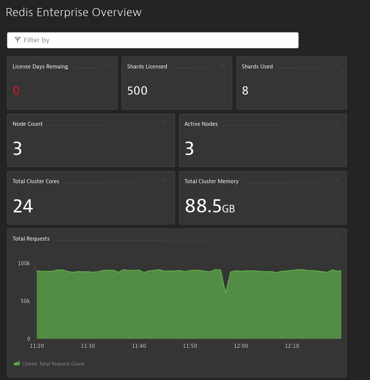
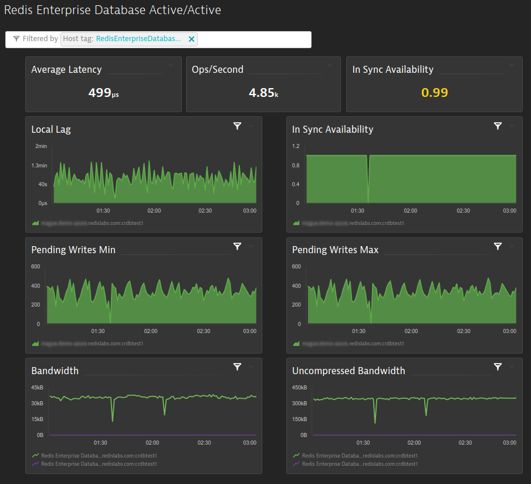
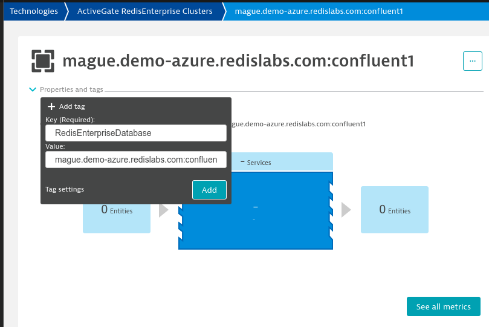

# Dynatrace ActiveGate Extension for Redis Enterprise

The Dynatrace ActiveGate extension for Redis Enterprise collects metrics from your [Redis Enterprise Software](https://docs.redis.com/latest/rs/) cluster using the [Dynatrace ActiveGate](https://www.dynatrace.com/support/help/setup-and-configuration/dynatrace-activegate) secure proxy.

You can then view these metrics and monitor your cluster from the [Dynatrace UI](https://www.dynatrace.com/support/help/how-to-use-dynatrace/dashboards-and-charts#expand--browse-and-display-dashboards--4).

## Table of Contents

* [Background](#background)
* [Prerequisites](#prerequisites)
* [Installation](#installation)
* [Dashboards](#dashboards)
* [Support](#support)
* [License](#license)

## Background

Dynatrace is a widely-deployed software-intelligence monitoring platform. If you're a Dynatrace customer and a Redis Enterprise user, you'll likely want to monitor your Redis Enterprise clusters from Dynatrace.

This extension uses [DynaTrace ActiveGate](https://www.dynatrace.com/support/help/setup-and-configuration/dynatrace-activegate), a secure proxy that works with [DynaTrace OneAgent](https://www.dynatrace.com/support/help/setup-and-configuration/) to collect metrics from your local network.

## Prerequisites

To install this extension, you will need:

1. A working [Dynatrace installation](https://www.dynatrace.com/support/help/setup-and-configuration/)
2. A [Dynatrace ActiveGate instance](https://www.dynatrace.com/support/help/setup-and-configuration/dynatrace-activegate/)
3. A Redis Enterprise Software cluster

You'll also need to ensure that the server running your ActiveGate instance can make HTTP connections to your Redis Enteprise cluster nodes using port 9443.

## Installation

To install the Dynatrace ActiveGate extension for Redis Enterprise, you'll need to:

1. Create a read-only Redis Enterprise user account with `cluster view` permissions. This accout will be used by the Dynatrace extension to access Redis Enterprise cluster metrics.
1. Install the Redis Enterprise ActiveGate extension on your ActiveGate node.
1. Configure and enable the extension from the Dynatrace UI.

These steps are described in more detail below.

### Create a read-only Redis Enterprise account

To create a new read-only user, first log in to the Redis Enterprise management console.

1. Follow the procedure for [adding a new user](https://docs.redis.com/latest/rs/security/access-control/manage-users/add-users/).
1. When selecting the new user's role, be sure to choose *Cluster viewer*.
1. For *Authentication*, select *Internal*.
1. Give the user a descriptive name (e.g., `dynatrace-agent@example.com`).
1. Use a long, secure password for this user.

### Install the extension

To install the extension:

1. Download the [latest release](https://github.com/redis-field-engineering/dynatrace-activegate-for-redis-enterprise/releases) of the extension. The release is provided as a zip file named `custom.remote.python.redisenterprise-{VERSION}.zip`.

1. Copy the extension to the server running your Dynatrace ActiveGate instance.

1. On the the same server, copy the extension to `/opt/dynatrace/remotepluginmodule/plugin_deployment/`.

1. Finally, restart the Dynatrace agent like so:

```
sudo service dynatracegateway restart
```

Next, use the Dynatrace UI to configure and enable the extension.

### Configure and enable the extension

From the the Dynatrace UI, navigate to Settings -> Monitoring -> Monitored Technologies -> Custom Extensions:


Click *Upload Extension* to upload the Redis Enterprise ActiveGate extension zip file (e.g., `custom.remote.python.redisenterprise-{VERSION}.zip`) that you installed onto your ActiveGate instance.

Once you've uploaded the extension, the extension will be listed under your monitored technologies. Click on the extension's name. Then select *Add new endpoint*. You'll be presented with the following screen:


Fill in the values as follows:

1. Endpoint name: Any name you'd like to use to identify this endpoint.
1. User: The username for the Redis Enterprise read-only user account.
1. Password: The password for the Redis Enterprise read-only user account.
1. State change interval: The frequency at which metrics change on the cluster, in seconds (default: 60).
1. URL: The URL for the Redis Enterprise REST API endpoint. Include the port (e.g., http://cache.cluster.redis.com:9443)
1. Event interval: The frequency at which events are logged, in seconds (default: 240).
1. Relative interval: The frequency at which relative metrics are logged, in seconds (default: 60).

Now, click *Add endpoint*. Then verify that the endpoint's status is *Ok*:


This *Ok* status indicates that agent has successfully connected. You can now monitor your cluster.

## View cluster metrics

Under *Infrastructure* click *Technology and Proceses*:


Then select REDIS_ENTERPRISE:


And select the *Active Gate RedisEnterprise Clusters*. You can view cluster metrics under the FQDN (fully-qualified domain name) of the cluster:


The database-level information is visible on the FQDN:DB_NAME devices.


You can also view events emitted by the cluster (e.g., denied logins, etc.):


### Enhanced Dashboards

This repository includes three sample dashboards for cluster, database, and active-active metrics:

* [Cluster metrics dashboard](dashboards/Redis_Enterprise_Overview.json)
* [Database metrics dashaboard](dashboards/Redis_Enterprise_Database.json)
* [Active Active metrics dashboard](dashboards/Redis_Enterprise_Database_Active_Active.json)

To get started more quickly, you can import these dashboard configuration into the Dynatrace management console. The above dashboard will look like this:






To enable filtering on the database dashboards above, you will need to manually tag the device because the current API does not allow us to do this automatically.

Go to Technologies -> ActiveGate RedisEnterprise Clusters -> CLUSTER and add the RedisEnterpriseDatabase tag.



To install the dashboards, save the JSON files above. Then import them by clicking *Import dashboards* from the dashboards page.

### Monitoring guide

This repository includes a [monitoring guide for Redis Enterprise](docs/RedisEnterpriseSoftwareMonitoringGuide.pdf). You should review this guide to better understand the Redis Enterprise KPIs and know what metrics to alert on.

### Troubleshooting guide

If you need help troubleshooting your plugin installtion, refer to this repository's [plugin troubleshooting guide](docs/TroubleShootingGuide.md).

## Support

The Dynatrace ActiveGate Redis Enterprise extension is supported by Redis, Inc. on a good faith effort basis. To report bugs, request features, or receive assistance, please [file an issue](https://github.com/redis-field-engineering/dynatrace-activegate-for-redis-enterprise/issues).

## License

The Dynatrace ActiveGate extension for Redis Enterprise is licensed under the MIT License. Copyright (C) 2023 Redis, Inc.