## Redis Enterprise ActiveGate Extension

### Prerequisites

1. Working [Dynatrace Install](https://www.dynatrace.com/support/help/setup-and-configuration/)
2. Working [ActiveGate Instance](https://www.dynatrace.com/support/help/setup-and-configuration/dynatrace-activegate/)
3. Login to a Redis Enterprise Cluster


### Architecture

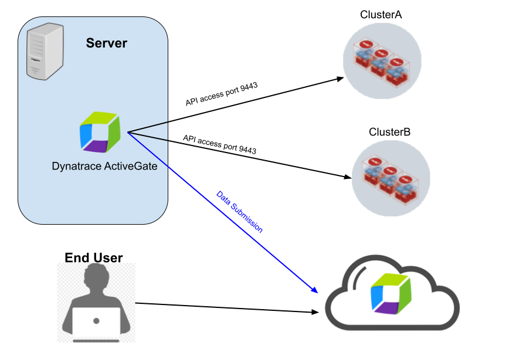


### Setup Account

#### Setup a read only user Account

Login to your Redis Entprise Instance and click on Access Control

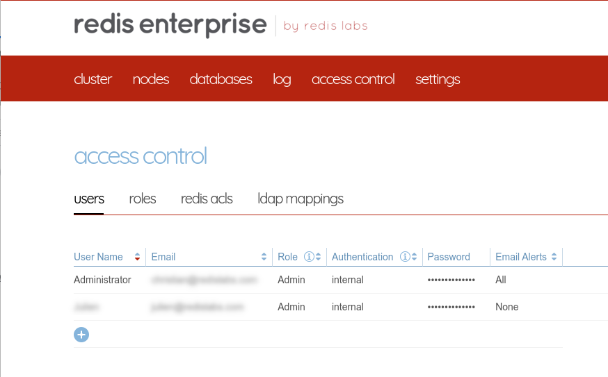


#### Add a new user account with Cluster View Permissions

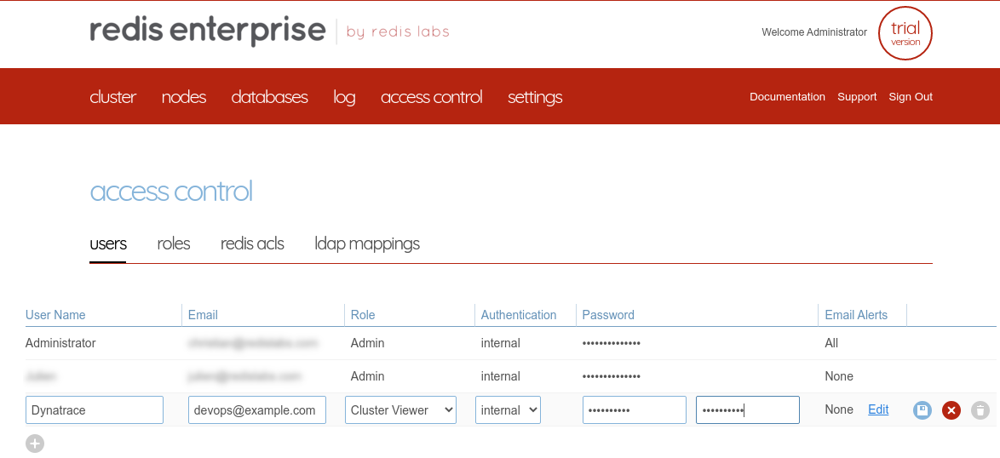


### SSH into your ActiveGate node

#### Install the Zip file

```
cd /tmp/ 
wget https://redislabs-field-engineering.s3.us-west-1.amazonaws.com/private-preview/active_gate_redisenterprise_plugin/custom.remote.python.redisenterprise.zip
sudo mv /tmp/custom.remote.python.redisenterprise.zip /opt/dynatrace/remotepluginmodule/plugin_deployment/custom.remote.python.redisenterprise.zip
```

#### Restart the service

```
sudo service dynatracegateway restart
```

### Install and setup custom extension

#### On Dynatrace go into Settings/Monitoring/Monitored Technologies/Custom Extensions Tab

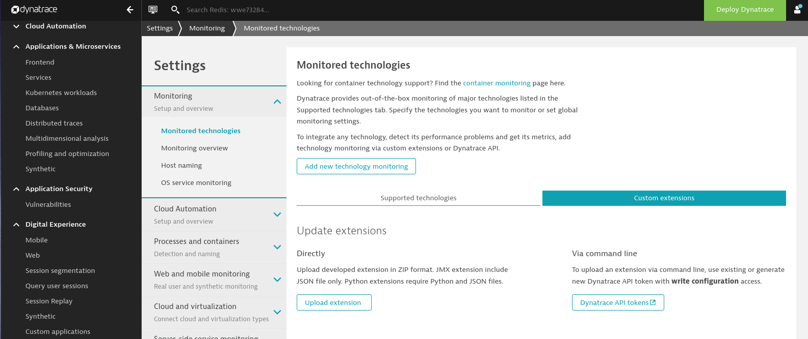

#### Click on Upload Extensions

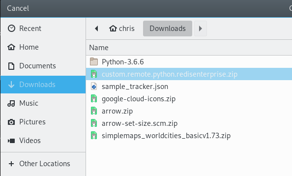

#### Upload Extension and click on the extension to configure the endpoint

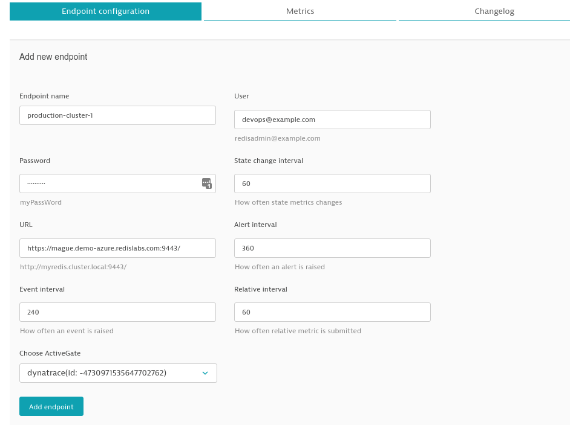

#### Check to ensure the Status is OK

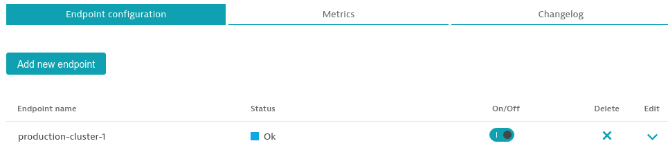

#### Under Infrastructuer Click on Technology and Proceses

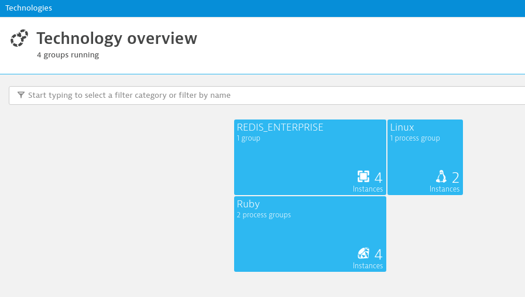

#### Select REDIS_ENTERPRISE

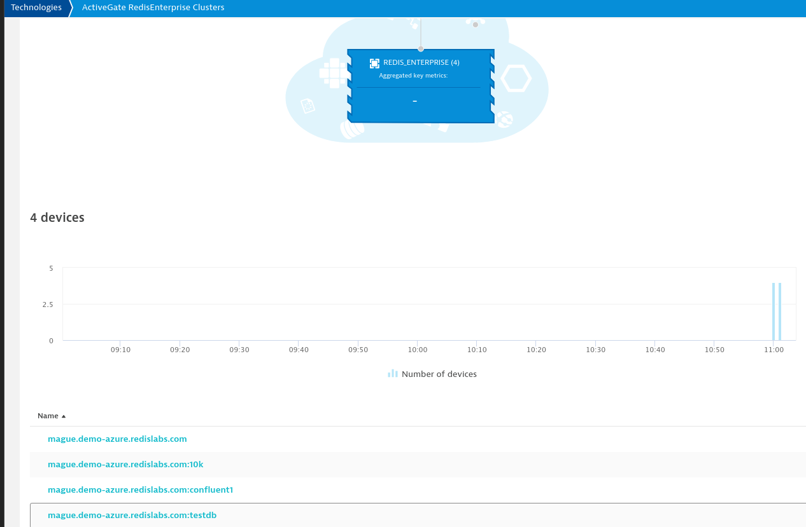

#### Select Active Gate RedisEnterprise Clusters

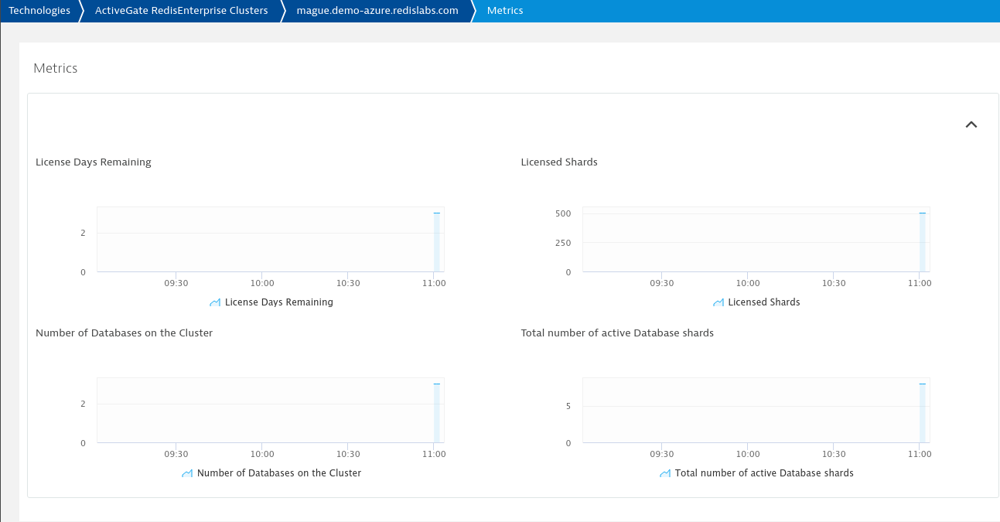

The cluster level information is the FQDN of the cluster and the database level information is on the FQDN:DB_NAME devices

#### Events

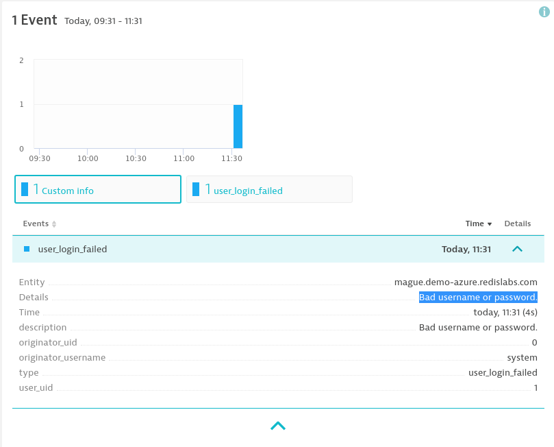

#### Cluster Stats


#### DB Stats
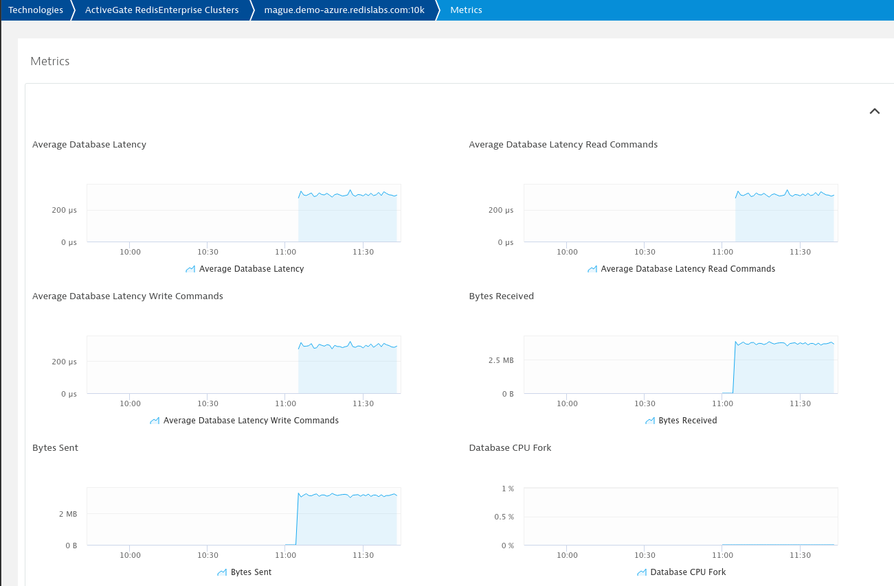
